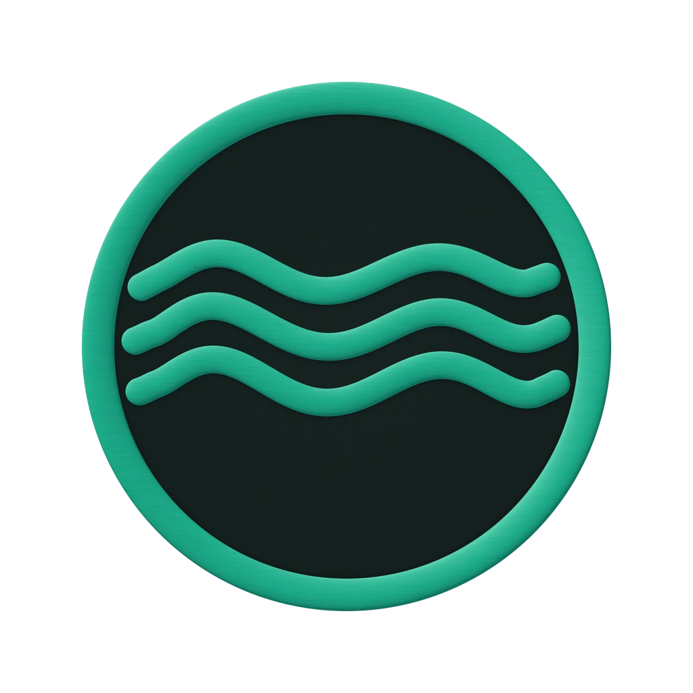

<!-- markdownlint-disable MD001 MD013 MD033 MD041 MD060 -->

<div align="center">



# Anclora Linguo Cam

### Peer-to-Peer-Videoanruf mit KI-gestützter Echtzeitübersetzung

Internes Tool, das P2P-Videoanrufe mit generativer Übersetzung kombiniert, um flüssige Gespräche zwischen Sprechern unterschiedlicher Sprachen zu ermöglichen.

[Español](./README.md) · [English](./README.en.md) · **Deutsch** · [Русский](./README.ru.md) · [Français](./README.fr.md) · [Italiano](./README.it.md)

<br />


</div>

---

> [!IMPORTANT]
> Internes Repository des Anclora-Ökosystems. Keine operativen Details, Zugangsdaten oder sensible Logik außerhalb autorisierter Kanäle veröffentlichen.

## Was es ist

Anclora Linguo Cam ist ein internes Punkt-zu-Punkt-Videoanruf-Tool (WebRTC über PeerJS), das ein generatives Modell (Google Gemini) integriert, um während des Gesprächs bei der Übersetzung zu unterstützen. Es kam am 02.08.2026 zum gouvernierten Anclora-Ökosystem hinzu, nachdem es zuvor als eigenständiges Produkt betrieben wurde.

## Kategorie im Ökosystem

| Feld | Wert |
|---|---|
| Kategorie | Intern |
| Markenakzent | `#59B635` |
| Typografie | Inter |
| Kanonisches Repository | `anclora-linguo-cam` |

## Kernfunktionen

- Peer-to-Peer-Videoanruf via PeerJS/WebRTC
- KI-gestützte Übersetzung (Google Gemini) während des Gesprächs
- Oberfläche mit FontAwesome-Ikonografie und Inter-Typografie

## Technologie-Stack

| Bereich | Technologie |
|---|---|
| Frontend | React, Vite |
| Generative KI | Google Gemini (`@google/genai`) |
| Videoanruf | PeerJS (WebRTC) |
| Typografie | Inter (Fontsource) |

## Lokaler Start

```bash
npm install
npm run dev
```

## Unterstützte Sprachen

Das Produkt unterstützt in der Produktion 6 Sprachen: Español (Standard), English, Deutsch, Русский, Français, Italiano (`UI_LOCALE_OPTIONS`, `App.tsx`). Diese Dokumentation wird in allen 6 Produktsprachen gepflegt.

## Dokumentation und Governance

- Marken- und Governance-Verträge: [`docs/standards/`](./docs/standards/)
- Anclora Vault (Quelle der Wahrheit): `contracts/` und `docs/governance/`

---

<div align="center">

### Anclora Group

Interne Nutzung.

</div>
